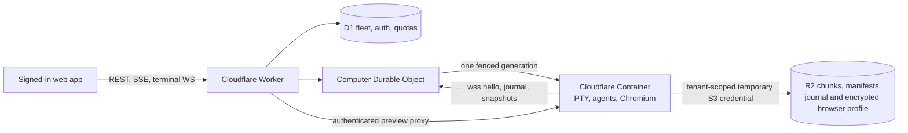

# Hosted v0.1 runtime

This is the production vertical slice shipped by the v0.1 branch. It names what
runs, what is durable, where credentials stop, and where the provider contract
forced the design to differ from the preferred Cloudflare-brainstem/Box-executor
split.

## Runtime and durability

- Each computer has one `ComputerDO`, one fencing epoch, and at most one live
  Cloudflare Container generation.
- `marid` owns real PTYs, process groups, terminal input/resize/signal semantics,
  journal offsets, snapshots, reconnect replay, and agent continuation.
- The container disk is a disposable hydrate/cache. Manifests and compressed,
  content-addressed chunks live in an opaque per-account R2 namespace. Mutable
  journal/run/state keys are additionally per computer.
- A scoped R2 credential is minted per generation and rotated through a clean
  snapshot/cold transition before expiry. Bucket-wide credentials are rejected
  in hosted production.
- Pane layout and lifecycle coordination are durable in the computer object;
  fleet/auth/ownership, the credential vault, usage, and quota ledgers live in
  D1.

## Browser computer mode

`mari-browser` starts Chromium on Xvfb, binds VNC to loopback, and serves noVNC
through `websockify` on port 6080. The web pane reaches that port only through
Mari's owner/capability-authenticated preview proxy.

The live Chromium profile is under `/work/.mari` and therefore excluded from
ordinary manifests. A helper checkpoints it as an AES-256-GCM archive. The
control plane derives a 256-bit key with HMAC over the owner and computer id,
hands only that derived key to the generation, and `marid` materializes it in a
mode-0600 runtime file. A fork receives a different key and cannot decrypt the
source computer's sessions; the launcher moves that foreign archive back under
the excluded `.mari` tree and starts the fork with an empty profile. The archive
is updated periodically and again when the browser run is stopped for a clean
sleep. Rotating `AUTH_SECRET` deliberately invalidates both login sessions and
existing browser-profile archives.

## Isolation and credentials

- R2 manifest/chunk sharing stops at the account root; temporary credentials
  cannot list, read, overwrite, or delete another account's objects.
- Vault values configure the supervisor but a run begins with an empty
  environment and receives only ordinary process variables plus explicitly
  named vault entries. `MARI_*` and `AWS_*` are reserved.
- The Linux supervisor is non-dumpable so same-uid child processes cannot read
  its environment from `/proc` without `CAP_SYS_PTRACE`.
- Permanent delete destroys the substrate first, removes mutable object-store
  data and D1 secrets/lineage, then removes the fleet row. A failed teardown
  retains the row and quota slot for a safe retry.

## Quotas, accounting, and costs

Hosted defaults are three computers and 100 AWAKE hours per UTC month. Create
and fork use an atomic D1 count-and-insert. Explicit wakes, run starts, writes,
uploads, and preview wakes pass the compute gate before the Durable Object is
addressed. Long AWAKE intervals are checkpointed by recurring alarms and split
at UTC month boundaries.

Rates verified on 2026-07-27:

| Runtime/storage | Estimate |
|---|---:|
| Cloudflare `standard-1`, AWAKE at 20% mean CPU | **$0.0452/hour** |
| Four active hours/day (120 hours/month) | **$5.42/computer-month** |
| R2 Standard delta storage | **$0.015/GB-month** |
| Box active VM time | **$0.036/hour** |

The Box figure is the published VM-second rate, not production usage: Box is
not scheduled in hosted v0.1. Its API has no delete operation and retains
archived snapshots indefinitely, so enabling it would make account deletion and
the `COLD` state dishonest. The provider is implemented and tested behind a
fail-closed experimental opt-in; the preferred pause-on-inference executor split
remains blocked until Box offers bounded deletion (or an equivalent disposable
execution resource).

These values exclude Workers/DO/D1 requests, R2 operations, free tiers, egress,
and provider rounding. They are operations estimates, never customer billing.
